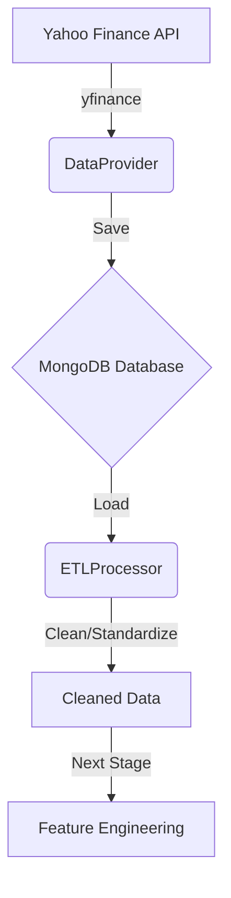

# 🍎 Dự báo giá cổ phiếu Apple (AAPL) - Big Data Pipeline

Dự án này triển khai một quy trình xử lý dữ liệu toàn diện (10 giai đoạn) để dự báo giá cổ phiếu Apple (AAPL) sử dụng Machine Learning và Deep Learning.

## 🚀 Tiến độ dự án
- [x] **Giai đoạn 1 & 2:** Thu thập dữ liệu (yfinance) & Lưu trữ (MongoDB / Big Data Optimized).
- [x] **Giai đoạn 3:** ETL - Làm sạch và chuẩn hóa dữ liệu.
- [x] **Giai đoạn 4 & 5:** EDA & Feature Engineering.
- [x] **Giai đoạn 6 & 7:** Model Training (Linear Regression, XGBoost) & Evaluation.
- [ ] **Giai đoạn 8 & 9:** Realtime Dashboard (Streamlit).
- [ ] **Giai đoạn 10:** Final Reporting.

---

## 🏗️ Kiến trúc hệ thống (Sơ đồ logic)


---

## 🛠️ Hướng dẫn cài đặt & Chạy dự án

### 1. Yêu cầu hệ thống
- Python 3.9+
- Môi trường ảo (venv)

### 2. Cài đặt
Mở terminal tại thư mục gốc và chạy:
```bash
# Tạo môi trường ảo
python3 -m venv venv

# Kích hoạt môi trường ảo
source venv/bin/activate  # MacOS/Linux
# venv\Scripts\activate   # Windows

# Cài đặt thư viện
pip install -r requirements.txt
```
*(Nếu chưa có file requirements.txt, hãy cài thủ công: `pip install yfinance pandas pyarrow fastparquet xgboost tensorflow streamlit matplotlib seaborn scikit-learn`)*

### 3. Chạy Pipeline (Giai đoạn 1-3)
Hiện tại, bạn có thể chạy script `main.py` để thực hiện thu thập và làm sạch dữ liệu:
```bash
python3 main.py
```

---

## 📁 Cấu trúc thư mục
- `data/`: Chứa các tệp dữ liệu dạng Parquet (Raw & Cleaned).
- `src/`: Mã nguồn chính của dự án.
    - `data_provider.py`: Class xử lý thu thập và lưu trữ dữ liệu.
    - `etl_processor.py`: Class xử lý làm sạch dữ liệu (ETL).
- `main.py`: Entry point điều phối các giai đoạn của pipeline.

---

## 👨‍💻 Tác giả
- **David** (Senior Data Scientist & Big Data Engineer)
- **Status:** In Progress (Completed Stages 1-7: Linear Regression, XGBoost, LightGBM, CatBoost)
