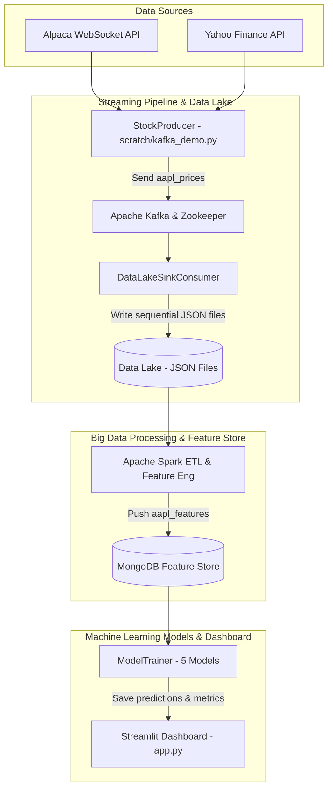

# 🍎 Apple (AAPL) Stock Price Prediction System - Big Data Pipeline

This project implements a comprehensive 10-stage data processing pipeline to predict Apple (AAPL) stock prices using Machine Learning and Deep Learning on a Big Data infrastructure (Apache Kafka, Apache Spark, Data Lake, and MongoDB).

---

## 🚀 Project Roadmap / Progress

- [x] **Stages 1 & 2:** Data Ingestion (yfinance/Alpaca) & Raw Data Storage.
- [x] **Stage 3:** ETL - Data Cleaning and Standardization using Apache Spark.
- [x] **Stages 4 & 5:** EDA & Feature Engineering (SMA, RSI, MACD, Lags).
- [x] **Stages 6 & 7:** Model Training (5 models: Linear Regression, XGBoost, LightGBM, CatBoost, ARIMA+LSTM) & Performance Evaluation.
- [x] **Stages 8 & 9:** Interactive Real-time Dashboard (Streamlit).
- [x] **Stage 10:** Algorithm Report & Model Comparison (`reports/`).

---

## 🏗️ System Architecture (Pipeline Logic)

The system operates as a real-time streaming data pipeline:


```mermaid
graph TD
    subgraph Data Sources
        API1[Alpaca WebSocket API]
        API2[Yahoo Finance API]
    end

    subgraph Streaming Pipeline & Data Lake
        Producer[StockProducer - scratch/kafka_demo.py]
        Kafka[Apache Kafka & Zookeeper]
        Consumer[DataLakeSinkConsumer]
        DataLake[(Data Lake - JSON Files)]
    end

    subgraph Big Data Processing & Feature Store
        Spark[Apache Spark ETL & Feature Eng]
        MongoDB[(MongoDB Feature Store)]
    end

    subgraph Machine Learning Models & Dashboard
        Trainer[ModelTrainer - 5 Models]
        Streamlit[Streamlit Dashboard - app.py]
    end

    API1 & API2 --> Producer
    Producer -->|Send aapl_prices| Kafka
    Kafka --> Consumer
    Consumer -->|Write sequential JSON files| DataLake
    DataLake --> Spark
    Spark -->|Push aapl_features| MongoDB
    MongoDB --> Trainer
    Trainer -->|Save predictions & metrics| Streamlit
```

---

## 🛠️ Setup & Running Guide

Please follow these steps in order to set up and run the system on your machine:

### Step 1: Spin up Infrastructure (Docker Containers)
The project utilizes **Kafka** as the message queue and **MongoDB** as the Feature Store. 

1. Start Kafka and Zookeeper via Docker Compose:
   ```bash
   docker-compose up -d
   ```

2. Start MongoDB (if you don't already have MongoDB running locally):
   ```bash
   docker run -d -p 27017:27017 --name mongodb mongo:latest
   ```

### Step 2: Virtual Environment Setup & Installation
Open your terminal in the project root directory and run:

```bash
# 1. Create a virtual environment (venv)
python3 -m venv venv

# 2. Activate the virtual environment
source venv/bin/activate  # On MacOS/Linux
# venv\Scripts\activate   # On Windows

# 3. Upgrade pip and install dependencies
pip install --upgrade pip
pip install -r requirements.txt
```

### Step 3: Configure Environment Variables
Create or modify the `.env` file in the root directory with the following variables:
```env
# MongoDB Connection String
MONGO_URI=mongodb://localhost:27017/

# Alpaca Markets API Configuration (Optional for real-time streaming)
ALPACA_API_KEY=YOUR_ALPACA_API_KEY
ALPACA_SECRET_KEY=YOUR_ALPACA_SECRET_KEY
```
*Note:* If the Alpaca API keys are not provided, the system automatically falls back to simulating historical streaming data using `yfinance` seamlessly.

### Step 4: Run Data Ingestion (Kafka Stream & Data Lake)
Start the Kafka Producer and Consumer to ingest raw data into the Data Lake:
```bash
python scratch/kafka_demo.py
```
*Description:* This script connects to Kafka, fetches hourly Apple (AAPL) stock transaction data, streams it through the Kafka topic `aapl_prices`, and the Consumer writes these blocks sequentially as partitioned JSON files into `data/data_lake/`. The demo script runs for about 15 seconds before gracefully shutting down.

### Step 5: Run Apache Spark Pipeline for ETL & Model Training
Run Apache Spark locally to perform ETL, compute technical indicators, and train 5 ML/DL models:
```bash
python main_spark.py
```
*Description:* Spark scans all JSON files under `data/data_lake/`, processes ETL & Feature Engineering, and feeds the processed dataset into model training. The evaluation reports (MAE, R2 score, etc.) and visual charts are saved in `reports/models_spark/`.

### Step 6: Launch the Streamlit Interactive Dashboard
Launch the premium interactive dashboard for real-time visualization and predictions:
```bash
streamlit run app.py
```
The application will automatically open in your browser at `http://localhost:8501`. Here you can:
- View tomorrow's Apple stock price prediction.
- Compare real-time performance and visual metrics of the 5 models.
- Play with interactive what-if scenarios by sliding market indicator values.
- Trigger the **Model Retraining** workflow with a single click in the sidebar.

---

## 📁 Project Directory Structure

```text
├── .agent/                  # AI Agent (David) configuration
├── data/
│   └── data_lake/           # Raw JSON files ingested from Kafka Stream
├── reports/                 # Algorithm reports and model comparison results
│   └── models_spark/        # Evaluation reports and charts generated by the Spark pipeline
├── scratch/
│   └── kafka_demo.py        # Kafka Stream demo pipeline script (Producer & Consumer)
├── src/
│   ├── models/              # Model architectures (XGBoost, ARIMA-LSTM, etc.)
│   ├── pandas_pipeline/     # MongoDB connectors and utilities
│   ├── spark_pipeline/      # Apache Spark pipeline for ETL & feature engineering
│   ├── model_trainer.py     # Class coordinating training and evaluations
│   └── utils.py             # System helpers and utility functions
├── app.py                   # Streamlit Dashboard main entry point
├── main_spark.py            # Apache Spark Pipeline (ETL + Training) main entry point
├── docker-compose.yml       # Configuration for Kafka and Zookeeper services
├── requirements.txt         # Project library dependencies
└── README.md                # System documentation (This file)
```
